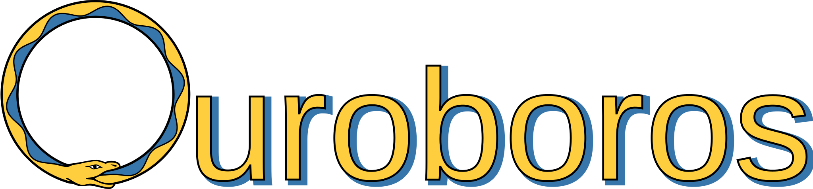
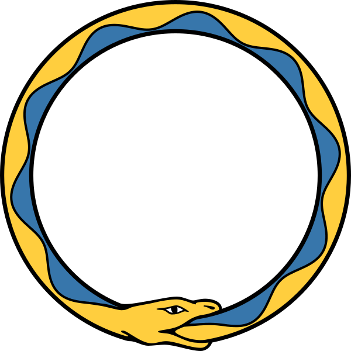

# Ouroboros

A free, open-source Python library for calculating the seismic normal modes of spherically-symmetric planets.

##### Mode calculations
 
 * Uses a Galerkin method.
 * Calculate modes of planets with any number of fluid and/or solid regions.
 * Handles all mode types (spheroidal, radial, toroidal).
 * Can include gravity (and Eulerian gravity perturbation).
 * Does not include non-spherical heterogeneity (including boundary topography), anelasticity, anisotropy, or rotation.

##### Other features
 
 * A Python wrapper for the [Mineos](https://geodynamics.org/cig/software/mineos/) library.
 * Synethic seismograms via normal-mode summation.
 * Calculation of sensitivity kernels.
 * Attenuation correction of mode frequencies.
 * Plotting:
    - Mode frequencies (dispersion diagram).
    - Mode eigenfunctions.
    - Sensitivity kernels.
    - Comparisons between different models.
    - Synthetic seismograms.

## Contents
  * [Using the code](#usage)
  * [Method](#method)
  * [Structure of code](#structure)
  * [Benchmarking and performance](#benchmarking)
  <!---*  [Examples](#examples) --->
  * [History and contributors](#history)
  * [How to contribute](#contribute)
  * [How to cite](#attribution)
  * [Related repositories](#related)
  * [References](#references)
  * [Research using this code](#applications)
  * [About the logo](#about_logo)

<a style="color: #000000" name="usage"/>

## Using the code

### Installation

You must have Python3 installed, including the packages NumPy and SciPy (and, for some functionality, MatPlotLib and ObsPy). We recommend using the Python environment manager [Anaconda](https://docs.anaconda.com/anaconda/install/) to install Python and manage Python packages. A suitable environment for the Ouroboros code can be created and activated with the commands

```bash
conda create --name Ouroboros python=3 numpy scipy matplotlib obspy
conda activate Ouroboros
```
Then, download this repository and it will be ready to use.

### Running the codes

Instructions for using the various codes are given in separate `README.md` files in the following directories:

 * [`modes/`](modes/README.md) Calculating the normal modes of a given model.
 * [`kernels/`](kernels/README.md) Calculating the sensitivity kernels of modes.
 * [`summation/`](summation/README.md) Calculating synthetic seismograms with mode summation.
 * [`mineos/`](mineos/README.md) Python wrappers for the [Mineos](https://geodynamics.org/cig/software/mineos/) normal-mode library, useful for comparison with Ouroboros.
 * [`misc/`](misc/README.md) Tools for common tasks in using these codes.

In general, the codes are called from the command line using Python, and usually they have a help message, for example you can try:

```
python3 modes/calculate_modes.py --help
```

<a href="#top">Back to top</a>

<!--- <a style="color: #000000" name="examples"/>
## Examples 

<a href="#top">Back to top</a> --->

<a style="color: #000000" name="history"/>
## History and contributors

This code has been developed mostly by members of the [GMIG group](http://gmig.blogs.rice.edu/) at Rice University. The core of the code was written in Matlab by Jingchen Ye and [Jia Shi](https://sites.google.com/view/jiashi/) around 2017. In 2019 it was translated to Python by [Jiayuan Han](https://github.com/hanjiayuan236), who made some improvements (versions 1, 2 and 3). Currently the code is maintained by [Harry Matchette-Downes](http://web.mit.edu/hrmd/www/home.html) (versions 4, 5, 6)
 
 * **Version 1:** Initial translation from Matlab. Can calculate the modes of an SNREI (spherically-symmetric, non-rotating, elastic, isotropic) Earth, with a solid inner core, fluid outer core, and solid mantle.
 * **Version 2:** The treatment of fluid regions was made more general, allowing any number of fluid regions to be included simply by altering the input file.
 * **Version 3:** Some small bugs were fixed relating to the units of different terms.
 * **Version 4:** This version contains small changes made by: code reorganisation to avoid duplication, more detailed documentation (including this file) and a user-friendly interface, and testing against Mineos, calculation of sensitivity kernels, and tools for plotting.
 * **Version 5**: Added and tested normal-mode summation.
 * **Version 6**: Added linear attenuation corrections (not fully tested).

<a href="#top">Back to top</a>

<a style="color: #000000" name="contribute"/>

## How to contribute

We welcome any form of contributions, such as bug reports, new code, feature requests, or comments.

<a href="#top">Back to top</a>

<a style="color: #000000" name="attribution"/>

## How to cite

If you use this repository for published research, please cite this work, for example 'we calculated modes using the *Ouroboros* code (Ye, 2018; Shi et al. 2020; <https://github.com/harrymd/Ouroboros>)'.

<a href="#top">Back to top</a>

<a style="color: #000000" name="related"/>

## Related repositories

* The [Matlab version](https://github.com/js1019/RadialPNM) of Ouroboros, which predates version 1 of the Python code, so it lacks some functionality and may contain small bugs.
* [NormalModes](https://github.com/js1019/NormalModes) and [PlanetaryModels](https://github.com/js1019/PlanetaryModels): implementation of the same method to non-spherically-symmetric planets. Mode summation for this 3D case is a work in progress, found [here](https://github.com/harrymd/NMSummation).

<a href="#top">Back to top</a>

<a style="color: #000000" name="references"/>

## References

* [Buland and Gilbert (1984)](https://doi.org/10.1016/0021-9991(84)90141-4). *Computation of free oscillations of the Earth*. Journal of Computational Physics 54.1, pp. 95-114.
* Dahlen and Tromp (1998) *Theoretical Global Seismology*. Princeton University Press.
* [Masters, Woodhouse, and Freeman (2011)](https://geodynamics.org/cig/software/mineos/). *Mineos*. Version 1.0.2.
* Matchette-Downes, Shi, Ye, Han, de Hoop and van der Hilst (in prep.) *Mixed Rayleigh-Stoneley modes: A new probe for Earth's core-mantle boundary*.
* [Shi, Li, Xi, Saad, de Hoop (2020)](https://arxiv.org/abs/1906.11082) *A Rayleigh-Ritz method based approach to
computing seismic normal modes in the presence of an essential spectrum*.
* [Ye (2018)](https://scholarship.rice.edu/handle/1911/104942) *Revisiting the computation of normal modes in SNREI models of planets - close eigenfrequencies* M.Sc. thesis, Rice University.

<a href="#top">Back to top</a>

<a style="color: #000000" name="applications"/>ß

## Works using this code

* Matchette-Downes, Shi, Ye, Han, de Hoop and van der Hilst (in prep.) *Mixed Rayleigh-Stoneley modes: Analysis of seismic waveguide coupling and sensitivity to lower-mantle structures*.

<a href="#top">Back to top</a>

<a style="color: #000000" name="about_logo"/>

## About the logo



The [ouroboros](https://en.wikipedia.org/wiki/Ouroboros) is an ancient symbol of a snake biting its own tail. This represents the essence of normal modes: closed orbits or ray paths, which allow constructive interference. The oscillating pattern of blue and yellow represents a normal-mode oscillation around the Earth. The snake also represents the Python programming language (and the colours are taken from the Python logo). Additionally, the ouroboros has a long relation with science and philosophy (for example, Kekulé reported a vision of an ouroboros when he discovered the structure of benzene).

The SVG logo was made in the free Inkscape software starting from a [public-domain image](https://en.wikipedia.org/wiki/File:Ouroboros-simple.svg) created by Wikipedia user [AnonMoos](https://commons.wikimedia.org/wiki/User:AnonMoos).

<a href="#top">Back to top</a>