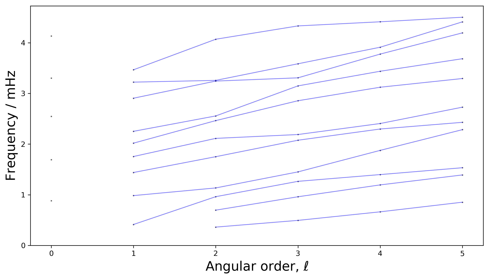
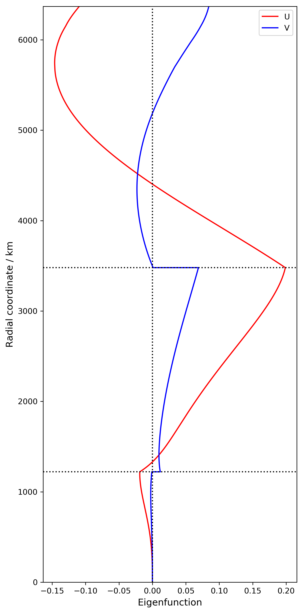
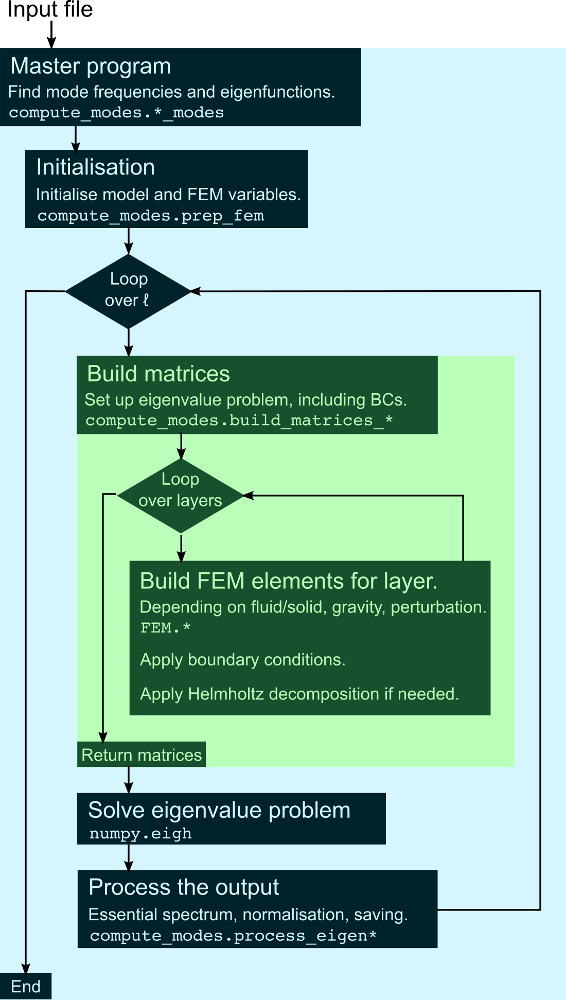
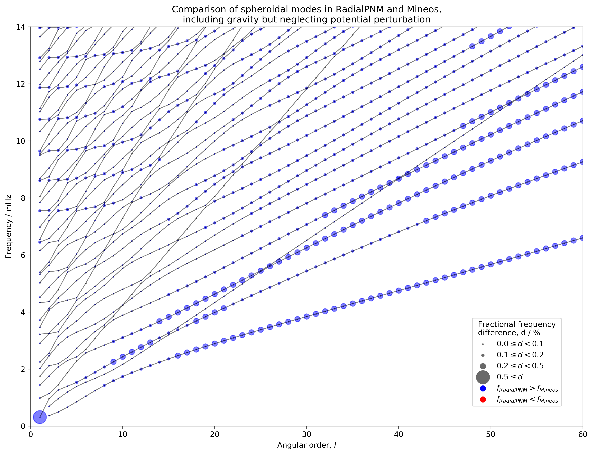
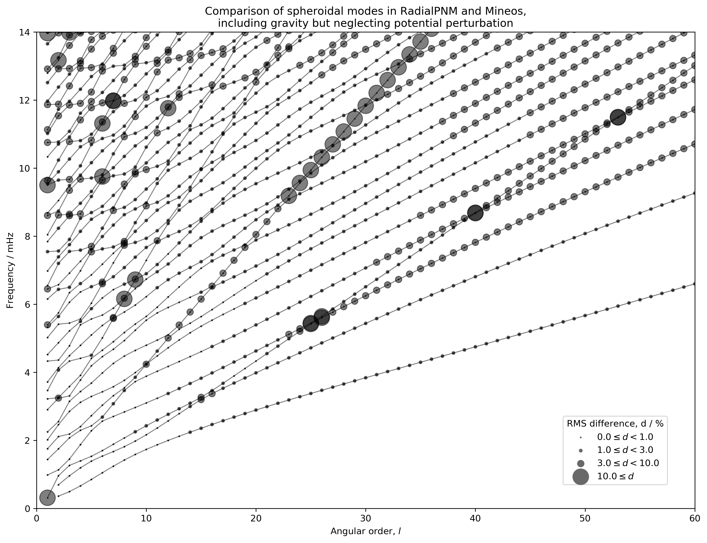

# Ouroboros

A *Python* package for calculating the seismic normal modes of spherically-symmetric planets using a finite-element method. The calculations can include gravity (including self-gravity), and any number of fluid and solid regions. Currently the code does not handle anisotropy, anelasticity, or rotation. Post-processing tools are provided for mode summation (to generate synthetic seismograms), and plotting of mode frequencies, eigenfunctions and sensitivity kernels.

## Contents
  * [Using the code](#usage)
  * [Method](#method)
  * [Structure of code](#structure)
  * [Benchmarking and performance](#benchmarking)
  * [Examples](#examples)
  * [History and contributors](#history)
  * [How to contribute](#contribute)
  * [How to cite](#attribution)
  * [Related repositories](#related)
  * [References](#references)

<a style="color: #000000" name="usage"/>

## Using the code

### Installation

You must have Python3 installed, including the packages NumPy and SciPy (and MatPlotLib if you wish to use the plotting scripts). We recommend using the Python environment manager [Anaconda](https://docs.anaconda.com/anaconda/install/) to install Python and manage Python packages. A suitable environment for the Ouroboros code can be created and activated with the commands

```bash
conda create --name Ouroboros python=3 numpy scipy matplotlib
conda activate Ouroboros
```
Then, download this repository and it will be ready to use.

### Running the code

To run the code, move to the top-level directory of the repository and run the main script from the command line:

```bash
python3 run.py
```
The default input file should run sucessfully without any other changes. You should see detailed output messages.

### Changing input variables

The script is controlled by the input file `input.txt` which has the following lines:

* `path_model`: The path to the model file (see note below).
* `dir_output`: The path to the desired output directory (see note below).
* `g_switch`: Should be one of `0` (no gravity), `1` (gravity but no perturbation), or `2` (gravity and perturbation). This should be set to `0` for toroidal modes (they are not affected by gravity, so we arbitrarily choose `0` for file-naming consistency).
* `mode_type`: Should be one of `R` (radial modes), `S` (spheroidal modes) or `T` (toroidal modes).
* `l_min l_max`: Two integers separated by a space, setting the lower and upper value of *ℓ*. These are ignored for radial modes (which have *ℓ* = 0). The computation time is proportional to the number of *ℓ* values.
* `n_min n_max`: Two integers separated by a space, setting the lower and upper value of *n*.
* `n_layers`: The number of layers in the finite-element model. The user should look for an optimal number of layers that is neither too small (this leads to inaccurate calculations for higher-frequency modes) nor too large (this leads to a very large, time-consuming eigenvalue problem). The details of the computational grid are handled internally by `lib.mantlePoint_equalEnd`, taking into account discontinuities and using a graded mesh with finer spacing near interfaces.

Modes with certain combinations of *n* and *ℓ* cannot exist without external forcing and are skipped by *Ouroboros*. These are: toroidal modes with *ℓ* = 0; all modes with *n* = 0, *ℓ* = 0; all modes with *n* = 0, *ℓ* = 1.

Note: the paths can be either absolute paths (e.g. `/usr/files/model.txt`) or relative paths (e.g. `../../output`).

The model file is currently specified using the same format as *Mineos* code (see the *Mineos* manual, Masters et al. 2011, section 3.1.2.1), although anisotropic wavespeeds are silently converted to the isotropic mean, and attenuation is currently ignored.

### The format of the output files

The path to the output is determined by the input parameters. For example, if `dir_output = ../output`, `path_model = model/my_model.txt`, `n_layers = 700`, `n_max = 5`, `l_max = 10`, `g_switch = 0`, and `mode_type = S`, then the output will be saved in `../output/my_model_00700/00005_00010_0/S`. The output consists of the two parts: eigenvalues and eigenvectors (also called eigenfunctions).

For a planet with multiple solid regions separate by fluid regions (for example, the Earth), the toroidal modes in each solid region are completely decoupled from the toroidal modes of other solid regions. Therefore, the eigenvalues for each solid region are saved in separate files `eigenvalues_000.txt`, `eigevalues_001.txt`, ..., labelling from the centre of the planet outwards, and similarly for the eigenfunctions. As an example, for Earth, `000` corresponds to inner-core toroidal modes and `001` corresponds to mantle toroidal modes. Fluid regions do not have toroidal modes (therefore entirely fluid planets do not have any toroidal modes).

Within the output directory, the eigenvalues are saved in the file `eigenvalues.txt`. Each line has the value of *n*, *ℓ* and the frequency (in mHz) for a given mode. The modes are listed in order of increasing *n*, then increasing *ℓ*.

The eigenvectors are stored in the subdirectory `eigenfunctions`. There is one file per mode. The files are stored in NumPy binary format to save space. They can be read with the `numpy.load` function. As an example, the mode with *n* = 3 and *ℓ* = 5 will be saved as `00003_00005.npy`. For spheroidal modes, the output is an array with three rows, corresponding to *r* (radial coordinate in metres), *U* (radial eigenfunction) and *V* (consoidal eigenfunction). For toroidal modes, there are just two rows, corresponding to *r* and *W* (toroidal eigenfunction). For radial modes, there are two rows, corresponding to *r* and *U*. For definitions of *U*, *V* and *W*, see Dahlen and Tromp (1998, section 8.6.1).

The normalisation of the eigenfunctions differs from the normalisation used in *Mineos*. Although we use the same normalisation formulae (specifically, the formulae given in section 3.2.3.2 of the *Mineos* manual), we use different units, so the results differ by a scalar factor. To match the eigenfunctions from the two codes, the eigenfunctions from *Ouroboros* must be multiplied by *R*<sup>2</sup>/1000, where *R* is the radius of the planet (in km). They might also have different signs (the sign of the eigenfunctions is arbitrary).

 <a href="#top">Back to top</a>

### Post-processing

#### Viewing the mode frequencies

Scripts are provided in the directory `plot/` to make simple plots of mode frequencies, eigenfunctions, and sensitivity kernels. For more control, you should edit these scripts.  Each plotting script uses the control file `input.txt` (same as used for running the calculations) to determine which results to plot. The plot files will appear in the same directory as the output of the calculations, in a subdirectory called `plots/`.

Without moving away from the top-level directory, you can plot the mode frequencies with the command

```bash
python3 plot/plot_dispersion.py
```

which yields the following figure for the example input file (note that in this case, the radial modes, with *ℓ* = 0, are added automatically if they are found in the output directory):



For toroidal modes, you must specify the solid region whose modes you wish to plot (see discussion in section *The format of the output files*, above). For example, to plot the  Earth's mantle toroidal modes you would use the command

```bash
# Plot toroidal modes from second solid region.
python3 plot/plot_dispersion.py 1
```

#### Viewing the mode displacement patterns

Similarly, eigenfunctions can be plotted from the command line, specifying *n* and *ℓ*:

```bash
# Plot mode with n = 2, l = 4.
python3 plot/plot_eigenfunctions.py 2 4
```
which yields the following figure using the example input file:



Once again, for toroidal modes you must also specify the index of the solid region (see *Viewing the mode frequencies*, above) as follows:

```bash
# Plot mode with n = 2, l = 4, from the second solid region.
python3 plot/plot_eigenfunctions.py 2 4 1
```

#### Sensitivity kernels

Sensitivity kernels are calculated using the formulae from Dahlen and Tromp (1998, section 9.3) derived using Rayleigh's principle.

#### Mode summation

The response of a planet to an earthquake source can be calculated by mode summation, as given by the formulae from Dahlen and Tromp (1998, section 10.3). Instructions for using the mode summation will be added soon.

<a href="#top">Back to top</a>

<a style="color: #000000" name="method"/>

## Method

To calculate the modes of a spherically-symmetric planet, we apply the Rayleigh-Ritz method (Dahlen and Tromp, 1998, section 7), refining the approach of Buland and Gilbert (1984). Our implementation is described fully by Ye (2018) and Shi et al. (2020), and summarised here. We use a weak form of the governing equations. We remove the undertones (modes associated with fluid flow, also known as the essential spectrum) from the solution space by introducing a variable related to pressure. We discretise this weak form with continuous mixed Galerkin finite elements to give a matrix eigenvalue problem. In the spherically-symmetric case, this eigenvalue problem can be solved using standard methods. The eigenvalues are the (squared) frequencies of the modes, and the eigenvectors are their displacement patterns.

<a href="#top">Back to top</a>

<a style="color: #000000" name="structure"/>

## Structure of code

The structure of the code is described by the following flowchart:



<a href="#top">Back to top</a>

<a style="color: #000000" name="benchmarking"/>

## Benchmarking and performance

### Testing against *Mineos*

The *Mineos* code (Masters et al., 2011) is the *de facto* standard for calculation of Earth's normal modes. Here we present a comparison between *Ouroboros* (version 3.s) and *Mineos* (version 1.0.2). We calculated all of the spheroidal modes with *n* < 50, *ℓ* < 60 and *f* < 15 mHz. We used the `demos/prem_noocean.txt` model from *Mineos*, modified by setting attenuation to 0. For *Ouroboros*, we used `n_layers = 700`. We made comparisons with only gravity (`g_switch = 1`, *Mineos* gravity cut off of 0 mHz) and gravity with perturbation (`g_switch = 2`, *Mineos* gravity cut off at arbitrarily high frequency, e.g. 50 mHz). In *Mineos*, gravity cannot be neglected altogether (`g_switch = 0` in *Ouroboros*), so we did not test this case (although all three cases converge for higher-frequency modes). Comparison of the frequencies (shown for the case `g_switch = 1` below) shows that frequency differences are small: less than 0.5 % for all modes except for <sub>2</sub>S<sub>1</sub>. We are not sure the cause of the discrepancy for this mode, which vanishes in the case `g_switch = 2`. The figure shows that the frequencies calculated with *Ouroboros* are systematically higher than the frequencies from *Mineos*, and the discrepancies are largest for modes with low *n* and high *ℓ*. We do not know what causes these systematic differences.



We can also compare the eigenfunctions, as shown in the figure below. The agreement is within 0.5 % in most cases, but significant differences are observed for the mode <sub>2</sub>S<sub>1</sub> (discussed above) and modes near occurring near the intersections of branches. We discuss this latter case in detail in Ye (2018) and Matchette-Downes et al. (in prep.). In short, we believe that the discrepancy is due to the failure of the numerical integration approach of *Mineos* to guarantee the orthogonality of the eigenfunctions, especially for the Stoneley-type modes (solid-fluid interface modes) for which it is difficult to enforce the boundary conditions. Apart from near-intersection modes, discrepancies are also found for modes with higher *ℓ*. We do not think these differences are intrinsic, but probably just due to the coarse grid in the default *Mineos* model (*Mineos* models have a hard-coded limit of 350 nodes, although this could easily be changed and re-compiled). For most practical applications, the differences between *Mineos* and *Ouroboros* will probably not be significant.



### Computational cost

The code is not optimised for speed, and tends to be slower than *Mineos* for calculating a similar number of modes. This is probably due to use of double-precision variables, initialisation of many variables including complicated objects (*Mineos* is written in Fortran, which promotes very lean code) and intrinsic differences between our method (FEM) and the integration method used in *Mineos*. Nonetheless, the modes required for most Earth-science and planetary-science applications can be calculated on a laptop in a reasonable amount of time. 

spheroidal_modes (switch = S_G): l =    50 (from     0 to    50)
Total time used: 2970.022 s

For example, the spheroidal modes of an Earth model with 700 layers can be calculated for *ℓ* up to 50 and *n* up to 60 in about X seconds without gravity, Y seconds with gravity, and Z seconds with gravity and perturbation using a single core of an [SKX compute node on the Stampede2 cluster](https://portal.tacc.utexas.edu/user-guides/stampede2#overview-skxcomputenodes). The eigenvalue problem at each value of *ℓ* is independent of the other *ℓ*-values, so it is trivial to parallelise the loop over *ℓ* ('embarrassingly parallel') if faster calculation is necessary.

### Computational limitations

We have not explored the limits of the code for high frequencies, large values of *ℓ*, or very complicated models. Calculations are performed at double precision, so numerical errors are probably small compared to typical model or data uncertainties in geophysics.

<a href="#top">Back to top</a>

<a style="color: #000000" name="examples"/>
## Examples

<a href="#top">Back to top</a>

<a style="color: #000000" name="history"/>
## History and contributors

This code has been developed by members of the [GMIG group](http://gmig.blogs.rice.edu/) at Rice University. The code was first developed in Matlab by Jingchen Ye and [Jia Shi](https://sites.google.com/view/jiashi/) around 2017. In 2019 it was translated to Python by [Jiayuan Han](https://github.com/hanjiayuan236), who made the improvements described below in versions 1, 2, 3 and 'Anelasticity'. Currently the code is maintained by [Harry Matchette-Downes](http://web.mit.edu/hrmd/www/home.html)and Jia Shi.

#### Version 1

Initial translation from Matlab. Can calculate the modes of an SNREI (spherically-symmetric, non-rotating, elastic, isotropic) Earth, with a solid inner core, fluid outer core, and solid mantle.

#### Version 2

The treatment of fluid regions was made more general, allowing any number of fluid regions to be included simply by altering the input file.

#### Version 3

Added code for the generation of synthetic seismograms by mode summation. Some small bugs were fixed relating to the units of different terms.

##### Version 3.h

This version contains small changes made by: code reorganisation to avoid duplication, more detailed documentation (including this Readme) and a user-friendly interface, and testing against Mineos, calculation of sensitivity kernels, and tools for plotting. It was used in our paper about mixed Stoneley-Rayleigh modes (Matchette-Downes et al., in prep.). Mode summation is not included in this version.

##### Version 'Anelasticity'

Work on anelasticity was started, but is not currently active.

<a href="#top">Back to top</a>

<a style="color: #000000" name="contribute"/>

## How to contribute

We welcome any form of contributions, such as bug reports, new code, feature requests, or comments.

<a href="#top">Back to top</a>

<a style="color: #000000" name="attribution"/>

## How to cite

If you use this repository for published research, please cite this work, for example 'we calculated modes using the *Ouroboros* code (Ye, 2018; Shi et al. 2020; <https://github.com/hanjiayuan236/RadialPNM_py>)'.

<a href="#top">Back to top</a>

<a style="color: #000000" name="related"/>

## Related repositories

* The [Matlab version](https://github.com/js1019/RadialPNM) of Ouroboros, which predates version 1 of the Python code, so it lacks some functionality and may contain small bugs.
* [NormalModes](https://github.com/js1019/NormalModes) and [PlanetaryModels](https://github.com/js1019/PlanetaryModels): implementation of the same method to non-spherically-symmetric planets. Mode summation for this 3D case is a work in progress, found [here](https://github.com/harrymd/NMSummation).
* Repository for the paper Matchette-Downes et al. (2020) (a work in progress).

<a href="#top">Back to top</a>

<a style="color: #000000" name="references"/>

## References

* [Buland and Gilbert (1984)](https://doi.org/10.1016/0021-9991(84)90141-4). *Computation of free oscillations of the Earth*. Journal of Computational Physics 54.1, pp. 95-114.
* Dahlen and Tromp (1998) *Theoretical Global Seismology*. Princeton University Press.
* [Masters, Woodhouse, and Freeman (2011)](https://geodynamics.org/cig/software/mineos/). *Mineos*. Version 1.0.2.
* Matchette-Downes, Shi, Ye, Han, de Hoop and van der Hilst (in prep.) *Mixed Rayleigh-Stoneley modes: A new probe for Earth's core-mantle boundary*.
* [Shi, Li, Xi, Saad, de Hoop (2020)](https://arxiv.org/abs/1906.11082) *A Rayleigh-Ritz method based approach to
computing seismic normal modes in the presence of an essential spectrum*.
* [Ye (2018)](https://scholarship.rice.edu/handle/1911/104942) *Revisiting the computation of normal modes in SNREI models of planets - close eigenfrequencies* M.Sc. thesis, Rice University.

<a href="#top">Back to top</a>