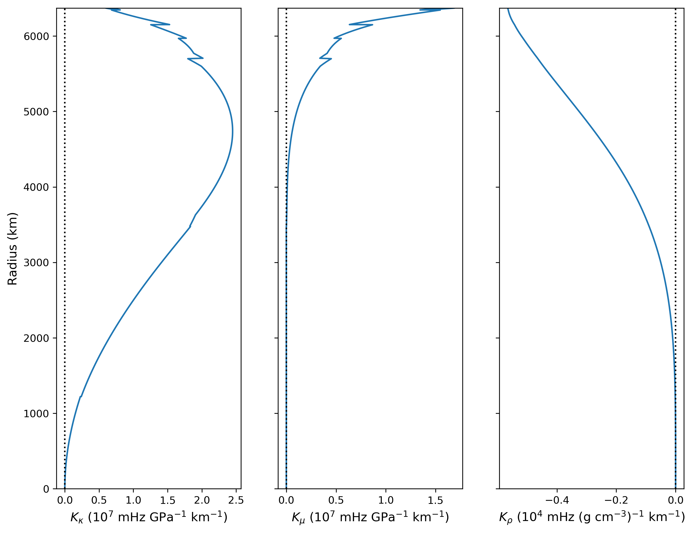

# Sensitivity kernels

Sensitivity kernels are calculated using the formulae from Dahlen and Tromp (1998, section 9.3) derived using Rayleigh's principle. Note that currently only the kernels *K<sub>κ</sub>* and *K<sub>μ</sub>* are implemented for radial and spheroidal modes, and toroidal mode kernels are not implemented.

## Running the code

When you calculate the normal modes (see `modes/README.md`), the kernels are also calculated and stored in the `kernels` subdirectory.

### The format of the output files

There are five relevant variables

 * *κ*, bulk modulus;
 * *μ*, shear modulus;
 * *ρ*, density;
 * *α*, P-wave speed; and
 * *β*, S-wave speed.

If *κ*, *μ*, and *ρ* are given, then *α* and *β* are uniquely determined. Similarly, if *α*, *β* and *ρ* are given, then *κ* and *μ* are uniquely determined. Therefore, it is natural to consider two equivalent of groups of three sensitivity kernels. The first group is

 * *K<sub>κ</sub>*, sensitivity to *κ* with fixed *μ* and *ρ*;
 * *K<sub>μ</sub>*, sensitivity to *μ* with fixed *κ* and *ρ*; and
 * *K<sub>ρ</sub>*, sensitivity to *ρ* with fixed *κ* and *μ*.
 
The second group is 

 * *K<sub>α</sub>*, sensitivity to *α* with fixed *β* and *ρ*;
 * *K<sub>β</sub>*, sensitivity to *β* with fixed *α* and *ρ*; and
 * *K<sub>ρ'</sub>*, sensitivity to *ρ* with fixed *α* and *β*.

Eventually, we plan to store the kernels as an array of shape (7, *n*) where *n* is the number of radial points, where the columns are *r*, *K<sub>κ</sub>*, *K<sub>μ</sub>*, *K<sub>ρ</sub>*, *K<sub>α</sub>*, *K<sub>β</sub>* and *K<sub>ρ'</sub>*. However, so far, only two of the kernels have been implemented, so the output has shape (3, *n*), where the columns are *r*, *K<sub>κ</sub>* and *K<sub>μ</sub>*. For each mode, this array is stored as a NumPy binary file (e.g. `kernels_00000_00002.npy` for a mode with *n* = 0 and *ℓ* = 2) which can be read with the `np.load` function.m 

### Plotting kernels

The syntax is very similar to plotting the mode eigenfunctions (see `modes/README.md`, or try `python3 plot/plot_kernels.py -h`). A command such as

```
python3 plot/plot_kernels.py inputs/example_input_Ouroboros.txt R 0 0
```

will produce a plot like



## Other functions

The `kernels/` directory also contains `kernels_brute.py` for calculating kernels by brute force (i.e., varying one layer at a time) for benchmarking. This is extremely computationally slow. This function is not intended for public use.

## Issues

### Some kernels not implemented

As discussed above, more kernels need to be implemented.

### Some kernels not benchmarked

So far, the sensitivity kernels have only been benchmarked against brute-force calculations for radial-mode sensitivity to bulk modulus, shear modulus and density. Future tests will benchmark the spheroidal and toroidal modes and the composition kernels which give sensitivity to P-wave speed, S-wave speed and density when these two are fixed. Until this is done, it is likely that there are errors in the units of the sensitivity kernels.