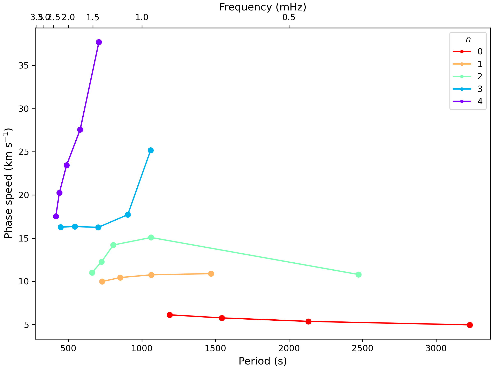

# Python wrappers for *Mineos*

[*Mineos*](https://geodynamics.org/cig/software/mineos/) is a widely-used Fortran code for calculating planetary normal modes via numerical integration of the radial scalar equations (see Dahlen and Tromp [1998], section 8). We use *Mineos* for benchmarking our codes. For convenience, we have written Python wrappers to prepare *Mineos* input files, and call the *Mineos* command-line codes using the Python standard module `subprocess`.

## Installation

*Mineos* must be installed (i.e., you must be able to run the *Mineos* commands from your command line, such as `minos_bran`, `eigcon`, `green` and `syndat`). Follow the installation instructions in the *Mineos* manual.

## Calculating mode eigenfrequencies and eigenfunctions

The syntax is very similar to calculating modes with Ouroboros:

```
python3 mineos/calculate_modes.py example/input/example_input_Mineos_modes.txt
```

although the input file is slightly different:

```
code mineos
path_to_model example/input/models/prem_noocean_at_03.000_mHz_noq.txt
path_to_outdir example/output/Mineos
gravity_switch 2 
mode_types R S T I 
n_limits 0 10 
l_limits 0 5 
f_limits 0.0 10.0 
eps 1.0E-10
max_depth 6371.0 
```

The differences in the input file (compared to Ouroboros) are:

* `mode_types` include `I` for inner-core toroidal modes (Ouroboros calculates all toroidal modes automatically).
* `f_limits` specifies a frequency cut-off for modes (in mHz).
* `eps` specifies the numerical accuracy of the integration.
* `max_depth` specifies the depth (in km) at which the eigenfunctions will be truncated. This can be `all` to include the whole planet. Note that *Mineos* has a bug when doing mode summation including radial modes if the eigenfunctions are saved with a large value of `max_depth` (including `max_depth = 'all'`). To avoid this bug, use a smaller value, e.g. 700.

### Plotting mode eigenfrequencies and eigenfunctions

The `plot_dispersion` and `plot_eigenfunction` commands ([`modes/README.md`](modes/README.md)) can be used for Mineos too:

```
python3 plot/plot_dispersion.py example/input/example_input_Mineos_modes.txt
```

```
python3 plot/plot_eigenfunctions.py example/input/example_input_Mineos_modes.txt S 3 5
```

In addition, Mineos calculates the phase and group speeds. These can be plotted with:

```
python3 plot/plot_group_and_phase_speeds.py example/input/example_input_Mineos_modes.txt phase
```

yielding



for phase speed, and similarly for group speed.

## Mode summation

Mineos includes a mode summation code (`green.f` and `syndat.f`). Ouroboros includes a wrapper for this code. The syntax is very similar to running Ouroboros mode summation:

```
python3 mineos/summation.py example/input/example_input_Mineos_modes.txt
example/input/example_input_Mineos_summation.txt
```

with input file

```
path_channels example/input/example_station_list_ANMO_3c.txt
path_cmt example/input/example_CMT_tohoku.txt
f_lims 0.0 5.0 
n_samples 8000
data_type 1 
plane 0
```

The first four inputs are The same as described in `summation/README.md`. `data_type` is 0, 1, or 2 for displacement, velocity or acceleration, as described in the Mineos manual, section 3.4.1. The `plane` is one of 0, 1, or 2, also described in this section of the Mineos manual.

### Plotting mode summation

The Ouroboros `plot_summation` command ([`summation/README.md`](summation/README.md)) can be used for Mineos output too by including the `--use_mineos` flag.

```
python3 plot/plot_summation.py example/input/example_input_Mineos_modes.txt example/input/example_input_Mineos_summation.txt ANMO LHZ --use_mineos
``` 

Note the Mineos bug mentioned above that affects summation involving radial modes.