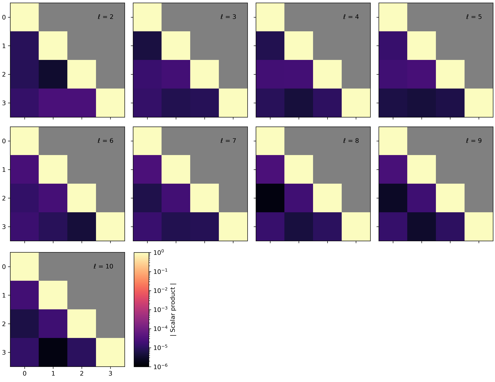
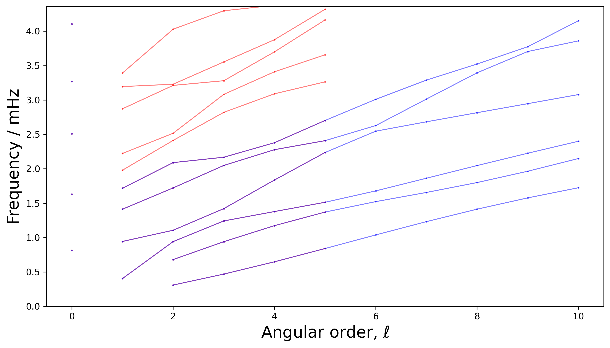
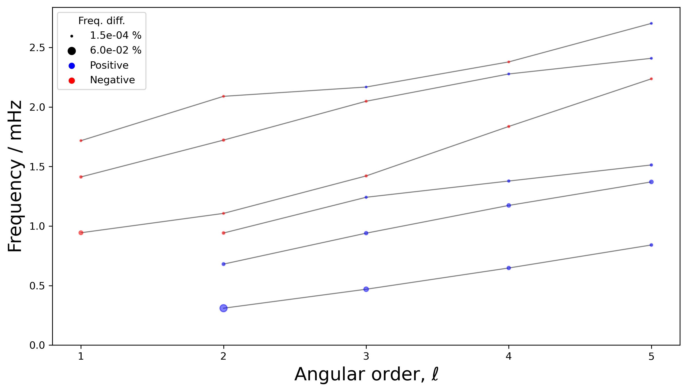
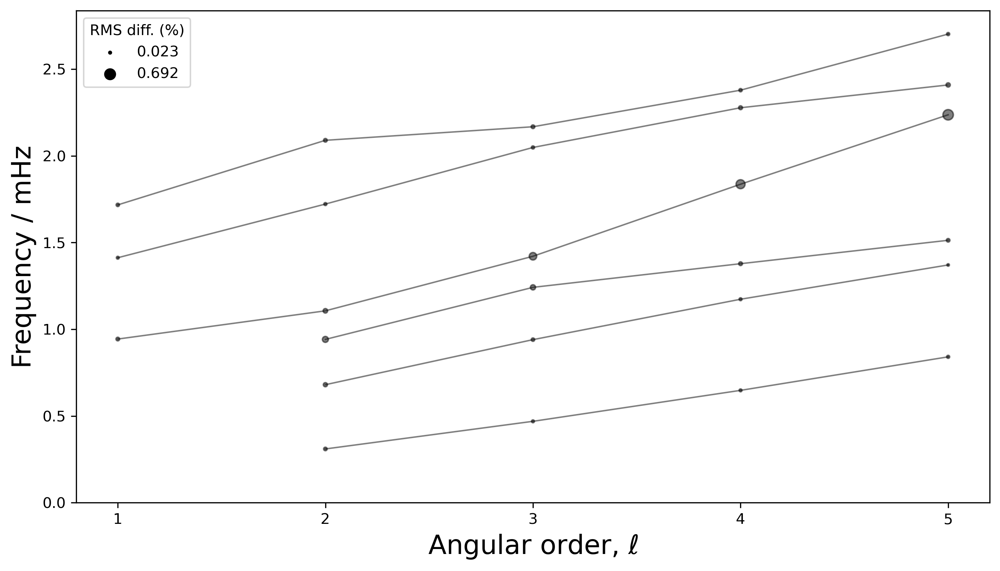

# Miscellaneous scripts

Various codes for common tasks in normal-mode calculations. In some cases these codes are not as carefully tested or user-friendly as the other functions in this repository.

## Checking normalisation

The `load_eigenfunction()` function in `common.py` can load the eigenfunctions with various normalisations as described in `modes/README.md` and `docs/Ouroboros_normalisation_notes.pdf`. The normalisation can be checked via numerical integration. A large number of options are available; try

```
python3 misc/check_normalisation.py -h
```

for instructions. For example, to check the normalisation of the mode 0S2, you could run

```
python3 misc/check_normalisation.py example/input/example_input_Ouroboros_modes.txt S 0 2 --eig_norm_units SI --eig_norm DT --r_scale 1.0 --f_scale 1.0 --rho_scale 1.0
```

which produces

```
Calculating normalisation
Mode     0 S     2
Freq.:   0.30985
omega:   0.00195
Max. density:  13088.500
Max. radius (from model file):   6371000.000
Max. radius (from eigfunc file): 6371000.000
Max. abs. eigfunc: 1.613e-12
I             = integral( rho * (U^2 + (k*V)^2) * (r^2) )
I             =  2.858e+00
I * (omega^2) =  1.083e-05


I             = integral( rho * (U^2 + V^2) * (r^2) )
I             =  1.000e+00
I * (omega^2) =  3.790e-06
```

which shows that the eigenfunctions are properly normalised (*I* = 1) when

 1. The eigenfunctions are loaded in SI units;
 2. SI units are used in the integration variables;
 3. The factors of *k* and *ω* are not included (i.e. the Dahlen and Tromp convention, `eig_norm = DT`).

If any of the above factors are changed, the others must also change to ensure correct normalisation. For example, if we want to load the eigenfunction in Mineos units (`--eig_norm_units mineos`), then we have have to rescale the variables as follows: `r_scale` = 1.0/6371000, `f_scale` = 1.0/(1.0754 * 10^-3 ), and `rho_scale` = 1.0/5515.0, i.e.:

```
python3 misc/check_normalisation.py example/input/example_input_Ouroboros_modes.txt --r_scale 0.00000015696123 --freq_scale 929.886553 --rho_scale 0.00018132366 --eig_norm DT --eig_norm_units mineos S 2 0
```

which preserves the normalisation:

```
I             = integral( rho * (U^2 + V^2) * (r^2) )
I             =  9.998e-01
```

For Ouroboros units (`--eig_norm_units ouroboros`), the only scaling required is  `--r_scale 1.0E-3` because 


This function can also be used with a Mineos input file.

## Checking eigenfunction orthogonality

The radial eigenfunctions should be orthogonal, in the sense that their scalar product is 1 with respect to themselves and 0 with other modes of the same *ℓ*-value. (Orthogonality with modes of different *ℓ*-values is guaranteed by the angular part of the eigenfunctions; orthogonality of different mode types [S and T] is guaranteed by the direction of their displacement.) The function `misc/orthogonality.py` can be used to check this condition, for example:

```python3 misc/check_orthogonality.py example/input/example_input_Ouroboros_modes.txt S```

which produces output such as

```
    1 of  1711: scalar product of   2 S   1 with   2 S   1: +1.000
    2 of  1711: scalar product of   2 S   1 with   3 S   1: +0.000
    3 of  1711: scalar product of   2 S   1 with   4 S   1: -0.000
	...
```

where in this case 1,711 is the number of pairs of modes in the database. This output is also saved in a summary file.

The results can be plotted using the command

```
python3 plot/plot_orthogonality.py example/input/example_input_Ouroboros_modes.txt 3 4
```

where 3 and 4 are the numbers of rows and columns, giving:



In this plot, each panel shows a specific *ℓ*-value. The x- and y-axis show the *n*-value of pairs of modes being compared. As expected, the diagonal elements (each representing the scalar product of a mode with itself) are close to 1, and the off-diagonal elements are close to 0.

These functions can also be used with a Mineos input file.

## Manipulating CMT files

If you have downloaded a moment-tensor solution from the [Global CMT](https://www.globalcmt.org/) project, it will be written in [NDK](https://www.ldeo.columbia.edu/~gcmt/projects/CMT/catalog/allorder.ndk_explained) format. To convert from *Mineos* to NDK, use a command such as

```
python3 misc/cmt_io.py --path_ndk example/input/example_CMT_tohoku.ndk
	--path_mineos tohoku.txt --mineos_dt 10.0
```

When using Mineos, the time interval between samples in the synthetic seismograms is also controlled by the *Mineos* CMT file (it is the 10th argument), but of course it is not part of the NDK format. Use the `--mineos_dt` flag to specify the time interval (in seconds). (This parameter is ignored in Ouroboros mode summation.)

## Comparing eigenfrequencies and eigenvalues with different inputs

Modes can be calculated using different models or different techniques. For instance, the examples in Ouroboros show how to calculate modes using Ouroboros (`modes/README.md`) or Mineos (`mineos/README.md`). To compare these two techniques, you can make an overlay plot of their frequencies using the `--path_input_comparison` flag:

```
python3 plot/plot_dispersion.py example/input/example_input_Ouroboros_modes.txt --path_input_comparison example/input/example_input_Mineos_modes.txt
``` 



It may be more helpful to plot their frequency differences, by adding the `--plot_diff eigvals` flag:

```
python3 plot/plot_dispersion.py example/input/example_input_Ouroboros_modes.txt --path_input_comparison example/input/example_input_Mineos_modes.txt --plot_diff eigvals
```



Note that only the common modes are shown.

It might also be useful to see how similar the eigenfunctions are. This can be calculated with a command such as 

```
python3 misc/compare_eigenfunctions.py example/input/example_input_Ouroboros_modes.txt example/input/example_input_Mineos_modes.txt
```

Note that toroidal modes haven't yet been implemented. The similarity is measured by the RMS difference between two eigenfunctions. This can be plotted with a similar command, only changing `eigvals` to `eigvecs`:

```
python3 plot/plot_dispersion.py example/input/example_input_Ouroboros_modes.txt --path_input_comparison example/input/example_input_Mineos_modes.txt --plot_diff eigvecs
```



## Convert Mineos output to Ouroboros format

Command to read Mineos frequency file and convert to Ouroboros output format:

```
python3 convert_mineos_eigval_file_to_ouroboros.py path_input {R,S,T,I,all}
```

## Counting modes in a given interval

After calculating the modes (see `modes/README.md` or `mineos/README.md`), you can count the number of modes in a given frequency interval, e.g.

```
python3 mode_count.py example/input/example_input_Ouroboros_modes.txt 0.0 3.0
```

gives

```
Searching for modes in the frequency range   0.000000 to   3.000000 mHz.
...
Mode type  R:     3 modes (multiplicity:     3), max. l:     0
Mode type  S:    48 modes (multiplicity:   536), max. l:    10
Mode type T0:     5 modes (multiplicity:    35), max. l:     5
Mode type T1:    14 modes (multiplicity:   102), max. l:     5
Totals:          70 modes (multiplicity   676)
```

The code also works for a Mineos input file such as `example/input/example_input_Mineos_modes.txt`.

The 'multiplicity' refers to the fact that the modes of a spherically-symmetrical planet are degenerate, so that each 'mode' (*n*, *ℓ*) is actually a group of 2*ℓ* + 1 modes of the same frequency.

## Re-write a planetary model without Q

Simply set Q to zero in a planetary model:

```
python3 misc/rewrite_model_with_Q.py example/input/models/prem_noocean.txt
```

## Plot a planetary model

```
python3 plot/plot_planetary_model.py example/input/models/prem_noocean.txt --vars rho v_p v_s
```


