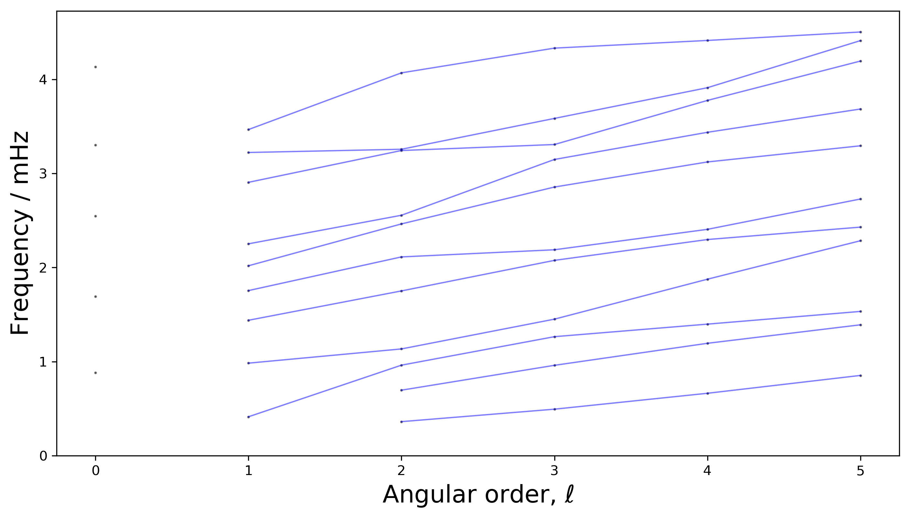
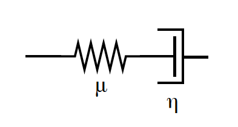
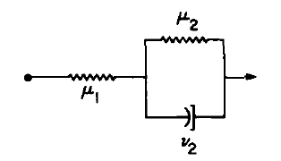
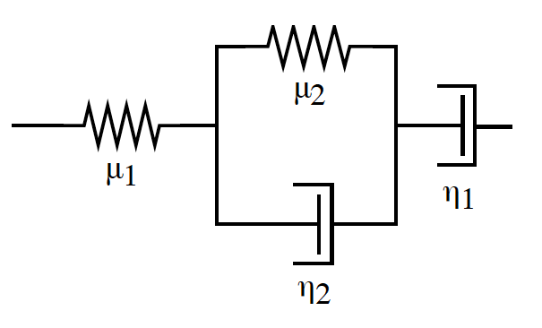
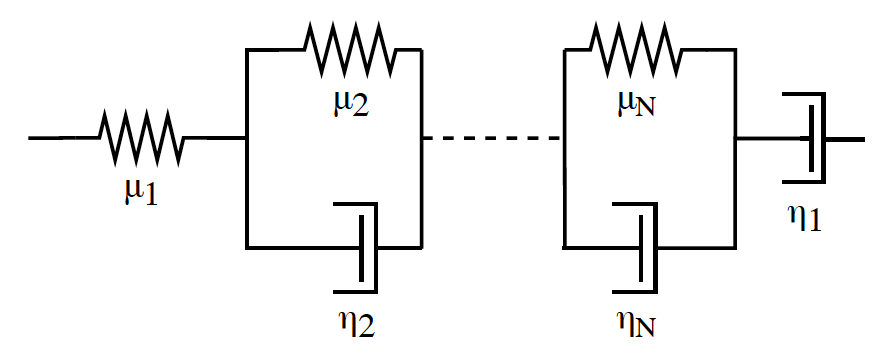
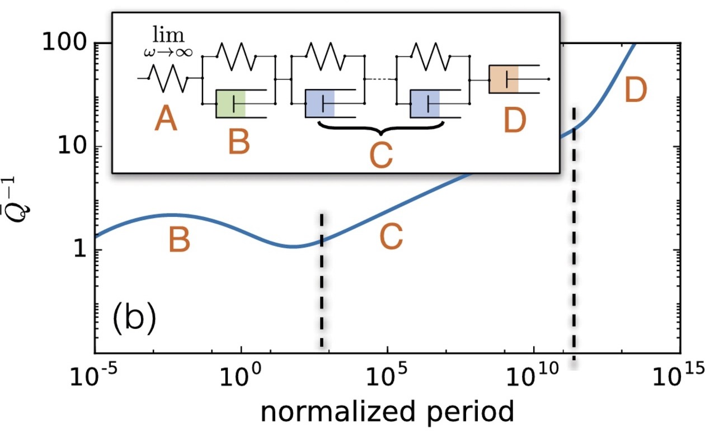
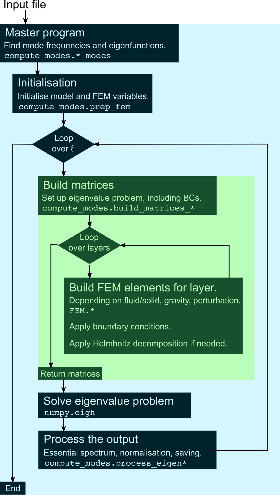
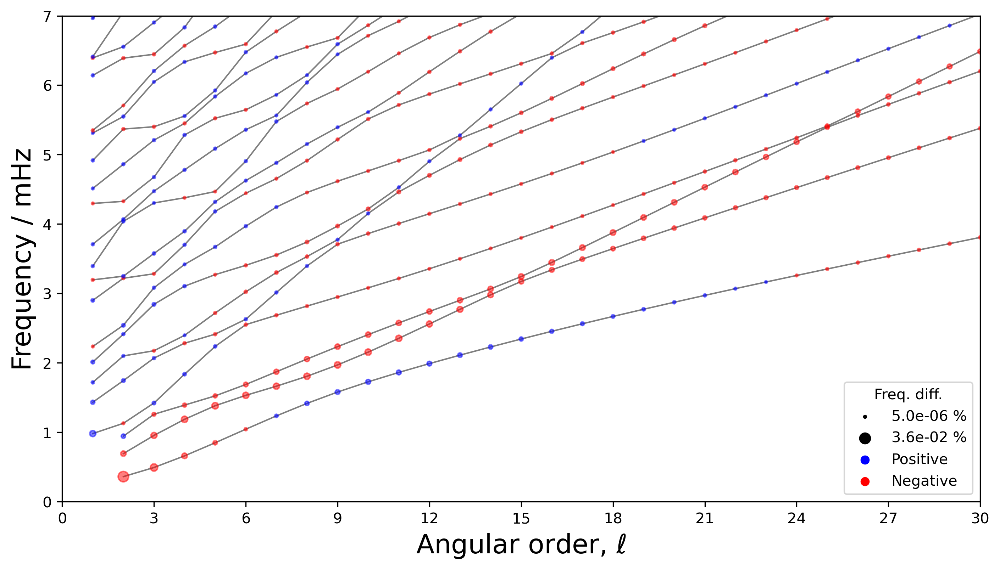
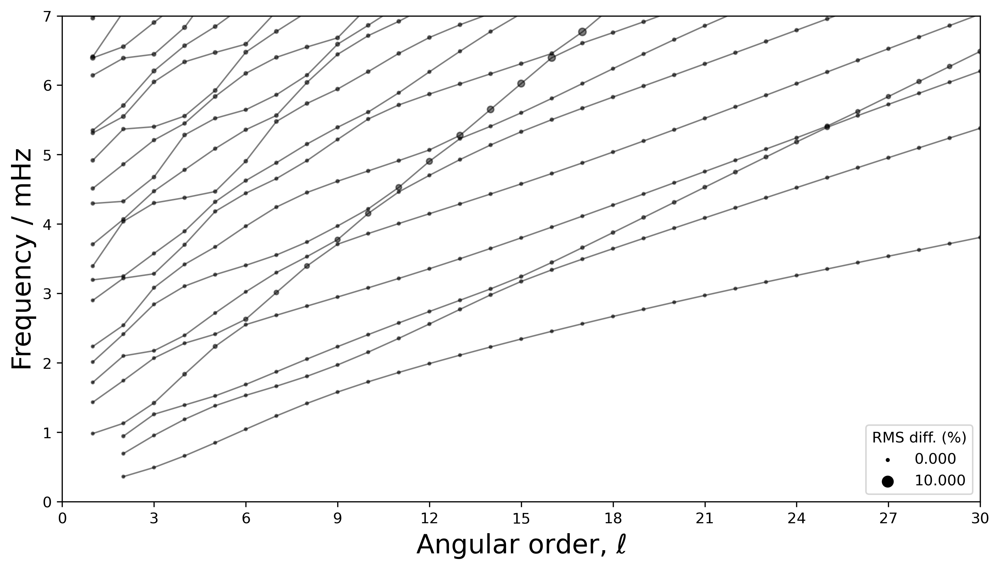
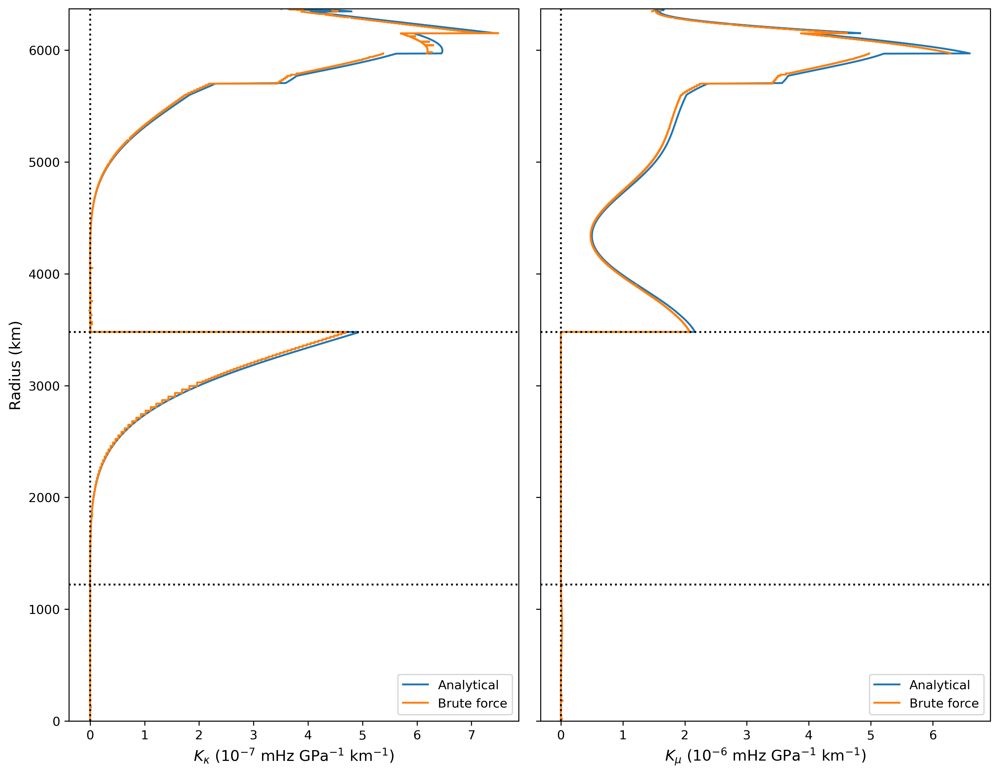

# Calculating normal modes

## Running the code

Call the main script from the command line:

```bash
python3 modes/calculate_modes.py example/input/example_input_Ouroboros_modes.txt
```

The only argument is the path to the input file. The default input file (shown here) should run sucessfully without any other changes, and provide detailed output messages.

### Changing the input variables

The example input file is

```
code ouroboros
path_to_model example/input/models/prem_noocean_at_03.000_mHz_noq.txt
path_to_outdir example/output/Ouroboros
gravity_switch 2 
mode_types R S T 
n_limits 0 5 
l_limits 0 10 
n_layers 700
attenuation none
```

Each line has a string descriptor followed by one or more arguments. The order of the lines must not be changed. The lines are

* `code`: `ouroboros` or `mineos` (see `mineos/` for instructions on using Mineos to calculate modes).
* `path_to_model`: The path to the model file (see note* below).
* `path_to_outdir`: The path to the desired output directory (see note* below).
* `gravity_switch`: Controls gravity. Ignored for toroidal modes. For radial and spheroidal modes, should be one of
 *  `0` (no gravity);
 * `1` (background gravity but no perturbation; Cowling approximation); or
 * `2` (background gravity and perturbation).
* `mode_types`: A list of mode types (separated by spaces). Should be one or more of
 * `R` (radial modes);
 * `S` (spheroidal modes); or
 * `T` (toroidal modes).
 *  Note that `I` is also used for Mineos modes to specify inner-core toroidal modes, but not for Ouroboros (Ouroboros will always calculate all groups of toroidal modes)
* `l_limits`: Two integers separated by a space, setting the lower and upper value of *ℓ*. These are ignored for radial modes (which have *ℓ* = 0). The computation time is proportional to the number of *ℓ* values.
* `n_limits`: Two integers separated by a space, setting the lower and upper value of *n*.
* `n_layers`: The number of layers in the finite-element model. The user should look for an optimal number of layers that is neither too small (this leads to inaccurate calculations for higher-frequency modes) nor too large (this leads to a very large, time-consuming eigenvalue problem). The details of the computational grid are handled internally by `modes.lib.mantlePoint_equalEnd()`, taking into account discontinuities and using a graded mesh with finer spacing near interfaces.

The last input (`attenuation`) relates to calculating the modes in the presence of dissipation. This is discussed later; here we assume that `attenation` is set to `none` (elastic calculation).

Modes with certain combinations of *n* and *ℓ* cannot exist without external forcing and are skipped by *Ouroboros*. These are:

* Toroidal modes with *ℓ* = 0;
* All modes with *n* = 0, *ℓ* = 0;
* All modes with *n* = 0, *ℓ* = 1.

*Note: the paths can be either absolute paths (e.g. `/usr/files/model.txt`) or relative paths (e.g. `../../output`).

### Format of the model file

The model file can be specified in one of two formats. The first option is the tabular format used by the *Mineos* code (see the *Mineos* manual, Masters et al. 2011, section 3.1.2.1), although anisotropic wavespeeds are silently converted to the isotropic mean, and attenuation is currently ignored. The second option is a simple space-separated text file with four columns: radius (increasing from 0, in km), density (in g/cm3), P-wave speed and S-wave speed (both in km/s). The second option contains no information about attenuation, and so cannot be used if an attenuation correction is being used.

#### The default model file

The default model file (`prem_noocean_at_03.000_mHz_noq.txt`) is based on the Preliminary Reference Earth Model (see references in master README file), which is included in the `DEMO/models/` directory of the Mineos package as `prem_noocean.txt`. We removed radial anisotropy is by taking the mean of the horizontally- and vertically-polarised wave speeds. We removed attenuation by setting the Q-values to zero (and `tref` to -1). A dispersion correction is used to make the model more appropriate for low-frequency normal-mode studies (see the function `create_adjusted_model.py` from `modes/attenuation_correction.py` for more detail). The original reference frequency of PREM (1 Hz) is changed to 3 mHz.

### The format of the output files

The path to the output is determined by the input parameters. For example, if `path_to_outdir = ../output`, `path_to_model = model/my_model.txt`, `anelastic` is `none`, `n_layers = 700`, `n_max = 5`, `l_max = 10`, `grav_switch = 0`, and `mode_type = S`, then the output will be saved in `../output/my_model_00700_elastic/00005_00010_0/grav_0/S`. The output consists of the two parts: eigenvalues and eigenvectors (also called eigenfunctions).

Within the output directory eigenvalues are saved in the file `eigenvalues.txt`, for spheroidal or radial modes. For the toroidal modes, there can be multiple output files when the planet has ith multiple solid regions separate by fluid regions (for example, the Earth), the toroidal modes in each solid region are completely decoupled from the toroidal modes of other solid regions. Therefore, the eigenvalues for each solid region are saved in separate files `eigenvalues_000.txt`, `eigevalues_001.txt`, ..., labelling from the centre of the planet outwards, and similarly for the eigenfunctions. As an example, for Earth, `000` corresponds to inner-core toroidal modes and `001` corresponds to mantle toroidal modes. Fluid regions do not have toroidal modes (therefore entirely fluid planets do not have any toroidal modes).

Each line of an eigevalue file lists the value of *n*, *ℓ*, the uncorrected and corrected frequency (in mHz), and the *Q*-factor for a given mode. (If not using the attenuation correction, then the corrected frequency will be the same as the uncorrected frequency, and the *Q*-factor will be 0). The modes are listed in order of increasing *n*, then increasing *ℓ*.

The eigenvectors are stored in the subdirectory `eigenfunctions`. There is one file per mode. The files are stored in NumPy binary format to save space. They can be read with the `numpy.load` function. As an example, the mode with *n* = 3 and *ℓ* = 5 will be saved as `00003_00005.npy`. For spheroidal modes, the output is an array with seven rows, corresponding to *r* (radial coordinate in metres), *U* and *U'* (radial eigenfunction and its gradient), *V* and *V'* (consoidal eigenfunction and its gradient), and *P* and *P'* (gravitational potential perturbation and its gradient). For toroidal modes, there are just three rows, corresponding to *r* and *W* and *W'* (toroidal eigenfunction and its gradient). For radial modes, there are five rows, corresponding to *r*, *U*, *U'*, *P* and *P'*. For definitions of *U*, *V*, *W*, and *P*, see Dahlen and Tromp (1998, section 8.6.1).

When exact attenuation is used (see [below](#exact-attenuation)), the eigenvalues and eigenvalues are complex numbers. <span style="color:red">Describe format here</span>.

The normalisation of the eigenfunctions used internally by *Ouroboros* differs from the normalisation used in *Mineos*. However, the scripts for loading eigenfunctions can convert between various normalisations; for more information, see `docs/Ouroboros_normalisation_notes.pdf` and the function `load_eigenfuncs()` from `common.py`.

By default, the sensitivity kernels are also calculated and stored in the subdictory `kernels`. For more information, see `kernels/README.md`.

#### Analytical solution for homogeneous sphere

You can run *Ouroboros* with a homogeneous model. However, in this simple case, analytical solutions exist (although so far we have only implemented toroidal modes). These can be calculated with the command

```
python3 modes/modes_homogeneous.py example/input/example_input_Ouroboros_modes_homogeneous.txt
```

where the example homogeneous input file is

```
code         ouroboros_homogeneous
dir_output   example/output/Ouroboros_homogeneous
r            6371.0E3
mu             80.0E9 
kappa         393.3333333333E9  
rho             5.0E3
n_max           5 
l_max          10
f_max_mHz       5.0
root_tol_mHz    1.0E-3
num_samples   200
```

where the inputs are:

* `dir_output`, `n_max`, `l_max`: Same as standard *Ouroboros* input file (see above).
* `r`: Radius of planet (m).
* `mu`: Shear modulus (Pa).
* `kappa`: Bulk modulus (Pa).
* `rho`: Density (kg m^-3 ).
* `f_max_mHz`: Upper frequency cut-off (mHz).
* `root_tol_mHz`: Numerical tolerance for zero-finding (mHz); controls the accuracy of the mode frequencies.
* `num_samples`: The number of radial samples in the eigenfunction files.

The outputs are saved in the same format as standard *Ouroboros* output, so all of the helper functions can be used in the same way.

 <a href="#top">Back to top</a>

### Plotting the output

#### Viewing the mode frequencies

To plot a mode diagram, try

```
# Plots spheroidal and radial modes.
python3 plot/plot_dispersion.py example/input/example_input_Ouroboros_modes.txt
```

The plot will appear on your screen, and will also be saved in `dir_output`, in a subdirectory called `plots/`. By default, the spheroidal modes are plotted, and the radial modes, with *ℓ* = 0, are added automatically if they are found in the output directory:



For toroidal modes, you must specify the solid region whose modes you wish to plot (see discussion in section *The format of the output files*, above). For example, to plot the  Earth's mantle toroidal modes you would use the command

```bash
# Plot toroidal modes from second solid region.
python3 plot/plot_dispersion.py example/input/example_input_Ouroboros_modes.txt --toroidal 1
```

<!--- To plot dispersion from *Mineos* output, use the same syntax with the `--mineos` flag. --->
Note that the `plot_dispersion()` function has other options which can be seen by running `python3 plot/plot_dispersion.py --help` or looking at `plot/README.md`.

#### Viewing the mode displacement patterns

Similarly, eigenfunctions can be plotted from the command line, specifying the mode type (R, S or T) as well as *n* and *ℓ*, for example

```bash
# Plot spheroidal mode with n = 2, l = 4.
python3 plot/plot_eigenfunctions.py example/input/example_input_Ouroboros_modes.txt S 2 4
```

which yields the following figure:


Once again, for toroidal modes you must also specify the index of the solid region (see *Viewing the mode frequencies*, above) as follows:

```bash
# Plot toroidal mode with n = 2, l = 4, from the second solid region.
python3 plot/plot_eigenfunctions.py example/input/example_input_Ouroboros_modes.txt
			T 2 4 --toroidal 1
```

<!--- For radial modes, *ℓ* must be 0. To plot modes from *Mineos* output, use the same syntax with the `--mineos` flag. --->
Note that the `plot_eigenfunctions()` function has other options which can be seen by running `python3 plot/plot_eigenfunctions.py --help` or looking at `plot/README.md`.

#### Including linearised attenuation correction

In a realistic planet, energy is lost through attenuation. This causes normal mode oscillations to decay, and causes an apparent decrease in the elastic moduli for lower-frequency oscillations (anelastic dispersion). For more detail, see Dahlen and Tromp (1998), sections 6 and 9.

In Mineos, anelastic dispersion is incorporated using the formulae 9.50 and 9.51, which assume that Q is indepedent of frequency. The frequency-dependent elastic modulus correction can be applied to the model for each mode separately (since the mode's frequency is approximately known in advance) before numerical integration. This ignores the complex (decaying) part of the eigenfunction.

This approach is not possible in our matrix-based formulation. The stiffness matrix must is the same for all modes. Therefore, we use the following procedure:

1. Apply a frequency correction to the model for a target frequency somewhere in the middle of the frequency band of modes we are interested in.
2. Calculate the modes.
3. Using the sensitivity kernels (which depend on the eigenfunctions), correct the mode frequencies.
4. Rescale the eigenfunctions (whose normalisation includes the mode frequencies) and related quantities (including sensitivity kernels).
5. Repeat steps 3 and 4 until changes are sufficiently small.

To include a linear attenuation correction, the last line of the input file must have the `linear` keyword an the target frequency in mHz:
```
attenuation linear 3.0
```

#### Exact attenuation

The last line of the input file must have the `full` keyword and the path of a second input file specifying the anelastic model.

```
attenuation full path/to/input_atten.txt
```

The format of the anelastic input file depends on the type of anelastic model which is specified in the first line, for example

```
model maxwell_uniform
```

specifies a Maxwell rheology which is the same for each element. Anelastic models which are currently supported are: `maxwell_uniform` and `burgers_uniform`. The input file is described for each model below:

##### Common parameters

The next line `control_file` gives the path to another text file which controls the eigenvalue search, for example

```
control_file example/input/example_nep_control_file.txt
```

Each line of the control file provides the parameters for one search, which are: the real and imaginary parts of the starting value (in mHz), the number of eigenvalues to seek, the maximum number of iterations, and the tolerance. For example, the example file has one line

```
1.0 0.0 5 100 1.0E-10
```

specifying a single search, starting from 1.0 mHz, for 5 eigenvalues, with up to 100 iterations and a tolerance of 1.0E-10. When multiple searches are used, duplicate eigensolutions are merged.

<span style="color:red">The parameter `n_eigs` controls the number of eigenvalues which are saved for each value of *ℓ*. The parameter `eig_start_mHz` is the starting point (frequency) for the eigenvalue search in mHz.</span>

##### Uniform Maxwell rheology



```
model maxwell_uniform
n_eigs 5
eig_start_mHz 1.0
eta 1.0E15
```

The parameter `eta` (η) is the viscosity of the Maxwell rheology in SI units (N m^-2 s^-1 ). The unrelaxed shear modulus (μ) is that of the input planetary model. Therefore μ can be a function of radius, but η is uniform throughout the planet.

##### Uniform Standard Linear Solid (SLS) rheology



Diagram from Yuen and Peltier (1982). 

```
model SLS_uniform
n_eigs 5
eig_start_mHz 1.0
eta2 1.0E16
mu2_factor 75.0
```

##### Uniform Burgers rheology



```
model burgers_uniform
n_eigs 5
eig_start_mHz 1.0
eta1 1.0E22
eta2 1.0E15
mu2_factor 75.0
```

The parameters `eta1` and `eta2` (η<sub>1</sub> and η<sub>2</sub>) are the viscosities of the dashpot elements (see diagram) in SI units (N m^-2 s^-1 ). The parameter `mu2_factor` gives the ratio μ<sub>2</sub>/μ<sub>1</sub> of the spring constants shown in the diagram. These three variables are uniform throughout the planet, but μ<sub>1</sub> is specified by the input planetary model, and so μ<sub>1</sub> and μ<sub>2</sub> can vary as a function of radius (but not independently).

##### Uniform Extended Burgers rheology: Spring-dashpot representation

The Extended Burgers (EB) rheology is usually represented as a Burgers element with additional Kelvin-Voigt elements (see diagram).



The input file looks like

```
model extended_burgers_uniform_SD
n_eigs 5
eig_start_mHz    1.0
path_SD_file  example/input/example_SD_file.txt
```

The file specified by `path_SD_file` lists the springs and dashpots which make up the rheology. The file has two columns which are the modulus μ (Pa) and viscosity η (Pa s) of each element. It has $N$ rows where $N$ is the number of elements. Remember that the first row is special because it corresponds to the elastic response (μ<sub>1</sub>) and creep response (η<sub>1</sub>). The example given in `example/input/example_spring_dashpot.txt` is

```
8.000000000000000000e+10 2.416000000000000000e+18
9.770585969912386475e+11 9.770585969912387133e+08
2.011636085436417847e+11 6.361351853364153290e+10
4.154793251572750854e+10 4.154793251572750977e+12
8.581227533293863297e+09 2.713622412535699062e+14
5.622385378273685303e+11 5.622385378273685504e+18
```

For this rheology, we use the analytical form of the response. This is converted to a rational form where the numerator and denominator are polynomials of degree $N$. It is numerically difficult to treat polynomials of high degree, so this rheology should not be used for values of $N$ larger than 10 or so. Finally, the rational form is written in terms of its roots and poles by finding   numerically the zeros of the numerator and denominator. This is the form required by the *NEP-PACK* library.

The frequency-dependent modulus can be plotted with

```
python3 anelasticity/plot/plot_response.py example/input/example_input_spring_dashpot.txt
```

##### Uniform Extended Burgers rheology: Empirical representation



Diagram from Lau and Faul (2019). In works such as Jackson and Faul (2015), they take the limit of a large number of elements, and their summation becomes an integral. The weighting of the integral is chosen to match experimental data. It has two peaks, the 'absorption band' (B) and the 'high-frequency plateau' (C).

We implement the EB model as described by Lau and Faul (2019), for the three mineralogies `olivine`, `wadsleyite` and `ringwoodite`. The input file looks like

```
model extended_burgers_uniform
n_eigs 5
eig_start_mHz    1.0
mineralogy	 olivine
temperature_K 1173.0
pressure_GPa     0.2
grain_size_m 	13.4E-6
```

#### Plotting complex modes

All of the standard plotting commands are compatible with `attenuation = full`. For example, `plot_dispersion()` will show the real part of the frequency of the oscillatory modes. To see the modes plotted on the complex plane, use

```
python3 plot/plot_complex_modes.py example/???
```

The standard command `plot_eigenfunctions()` will show the real and imaginary parts of the eigenfunctions. For the previous two commands, the `--relaxation` flag can be used to show relaxation modes, and the `--duplicate` flag can be used to show duplicate modes.


<a style="color: #000000" name="method"/>

## Method

To calculate the modes of a spherically-symmetric planet, we apply the Rayleigh-Ritz method (Dahlen and Tromp, 1998, section 7), refining the approach of Buland and Gilbert (1984). Our implementation is described fully by Ye (2018) and Shi et al. (2020), and summarised here. We use a weak form of the governing equations. We remove the undertones (modes associated with fluid flow, also known as the essential spectrum) from the solution space by introducing a variable related to pressure. We discretise this weak form with continuous mixed Galerkin finite elements to give a matrix eigenvalue problem. In the spherically-symmetric case, this eigenvalue problem can be solved using standard methods. The eigenvalues are the (squared) frequencies of the modes, and the eigenvectors are their displacement patterns.

<a href="#top">Back to top</a>

<a style="color: #000000" name="structure"/>

## Structure of code

The structure of the code is described by the following flowchart:



<a href="#top">Back to top</a>

<a style="color: #000000" name="benchmarking"/>

## Benchmarking and performance

### Testing against *Mineos*

The *Mineos* code (Masters et al., 2011) is the *de facto* standard for calculation of Earth's normal modes. Here we present a comparison between *Ouroboros* (version 6) and *Mineos* (version 1.0.2). We used the `example/input/models/prem_noocean_at_03.000_mHz_noq.txt` model discussed above. For *Ouroboros*, we used `n_layers = 700`. We made comparisons with only gravity (`g_switch = 1`, *Mineos* gravity cut off of 0 mHz) and gravity with perturbation (`g_switch = 2`, *Mineos* gravity cut off at arbitrarily high frequency, e.g. 50 mHz). In *Mineos*, gravity cannot be neglected altogether (`g_switch = 0` in *Ouroboros*), so we did not test this case (although all three cases converge for higher-frequency modes). Comparison of the frequencies (shown for the case `g_switch = 1` below) shows that frequency differences are small: less than 0.04 % for all modes.



We can also compare the eigenfunctions, as shown in the figure below. The agreement is good. Disagreement is largest for ICB Stoneley modes, but we believe this is due only to insufficient radial sampling in the input model.



Note that if the model is not corrected to an appropriate reference frequency before calculating the modes, we observe larger differences. This is discussed in `docs/comparison_Ouroboros_Mineos.pdf`.

### Computational cost

The code is not optimised for speed, and it is signficantly slower than *Mineos* for calculating a similar number of modes. This is probably due to intrinsic differences between our method and the integration method used in *Mineos*. Other contributing factors are the used of double-precision variables, and the initialisation of many variables including complicated objects (*Mineos* is written in Fortran, which promotes very lean code). Nonetheless, the modes required for most Earth-science and planetary-science applications can be calculated on a laptop in a reasonable amount of time. 

For example, the spheroidal modes of an Earth model with 700 layers can be calculated for a given *ℓ*-value in about one minute on a laptop. The eigenvalue problem at each value of *ℓ* is independent of the other *ℓ*-values, so it would be trivial to parallelise the loop over *ℓ* ('embarrassingly parallel') if faster calculation were necessary.

### Computational limitations

We have not explored the limits of the code for high frequencies, large values of *ℓ*, or very complicated models.

### Known issues

#### Disagreement with *Mineos* for certain models

See `docs/comparison_Ouroboros_Mineos.pdf`.

#### Instabilities in eigenfunctions

See `docs/comparison_Ouroboros_Mineos.pdf`.

#### Discrepancy in sensitivity kernels

The sensitivity kernels are about 4% larger than those calculated with a brute-force approach.



Additionally, visual comparison with the examples given in Dahlen and Tromp (1998) figure 9.13 (page 352) shows a small disagreement in the toroidal sensitivity for mode 8S2.