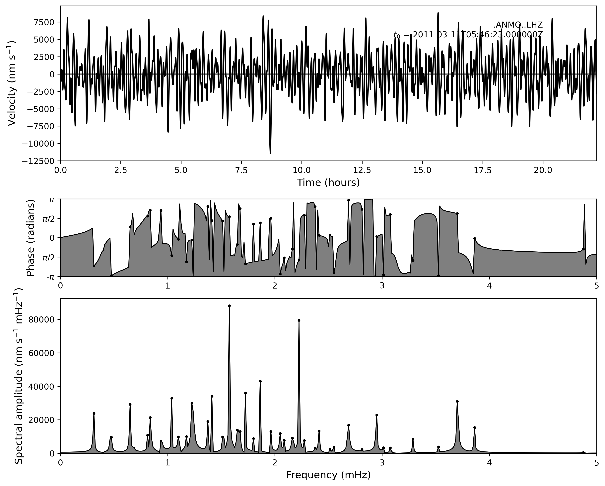
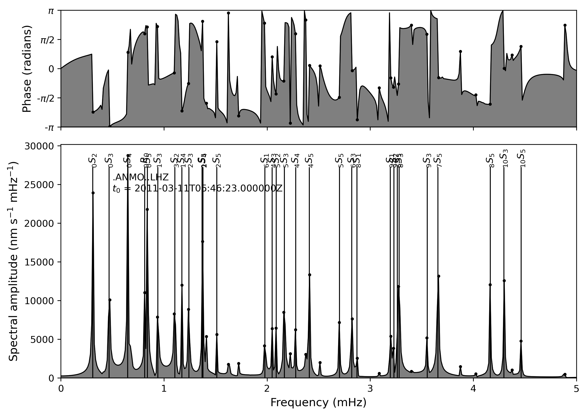
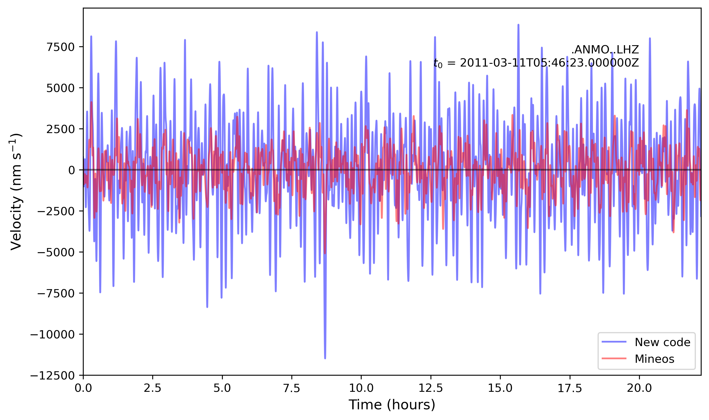
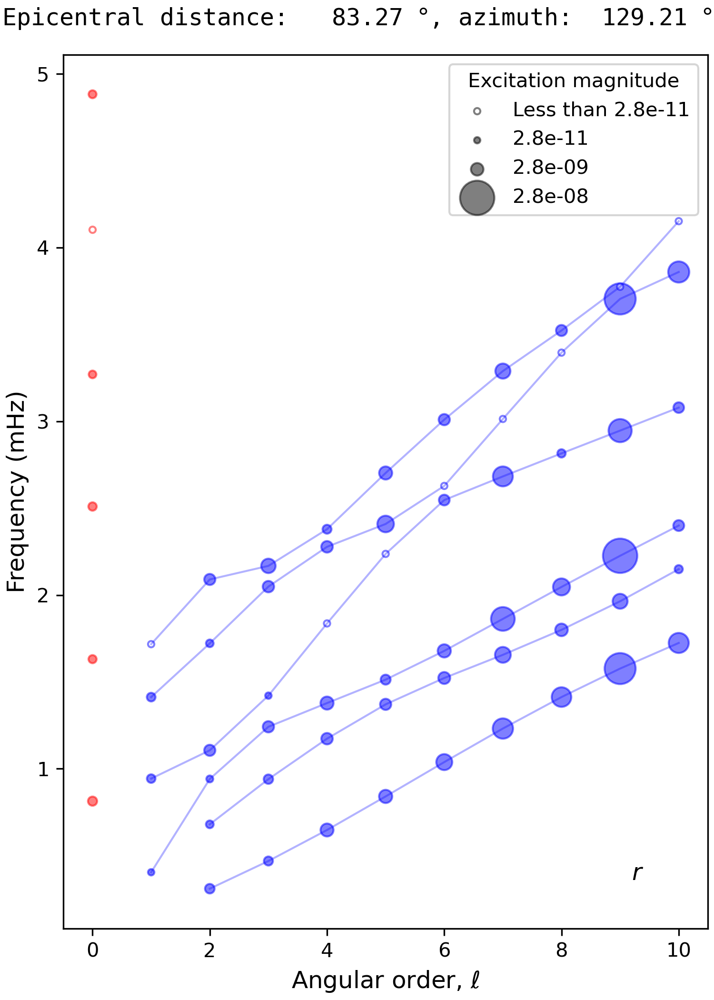
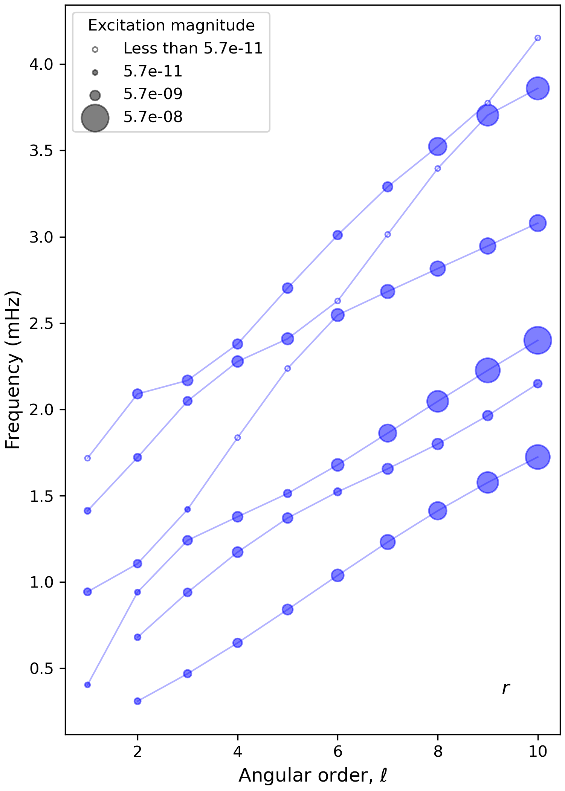

# Mode summation

The response of a planet to an earthquake source can be calculated by mode summation, as given by the formulae from Dahlen and Tromp (1998, section 10.3). These are re-written in detail in `docs/summation_notes.pdf`.

Note that, currently, toroidal modes are not implemented.

## Using the code

### Preparing mode input

First, you must calculate the mode frequencies and eigenfunctions:

 ```
 python modes/calculate_modes.py example/input/example_input_Ouroboros_modes.txt
 ```
    
For more information on mode calculation, see `modes/README.md`.
    
### Summing modes

Summation takes two input files. The first input file is just the mode calculation input file. The second input file is specific to mode summation.

```
python summation/run_summation.py example/input/example_input_Ouroboros_modes.txt example/input/
	example_input_Ouroboros_summation.txt
```

The summation input file (`example_input_Ouroboros_summation.txt`) looks like

```
mode_types R S 
f_lims 0.0 5.0
path_channels example/input/example_station_list_ANMO_3c.txt 
path_cmt example/input/example_CMT_tohoku.txt
time_step 10.0
n_samples 8000
pulse triangle
output_type velocity
attenuation full 
correct_response 1 
epi_dist_azi_method mineos
path_mode_list none
```

where the lines are

* `mode_types`: A list of mode types to include (`R` and/or `S`; toroidal modes not implemented yet).
* `f_lims`: Frequency limits (mHz) for modes to include.
* `path_channels`: Path to the 'channels' file. This file lists the location of the seismometer stations and the orientation of the recording channels. The format of the channels file is described in the Mineos manual, section 4.4. It is passed to the *Mineos* utility `simpledit` for conversion into a CSS database before summation. The example is a three-component seismometer [ANMO](https://earthquake.usgs.gov/monitoring/operations/stations/IU/ANMO/) in New Mexico.
* `path_cmt`: Path to the 'CMT' (centroid moment tensor) file, which describes the earthquake source. The format of the CMT file is described in the Mineos manual, section 3.3.2. Note that Ouroboros includes some intsructions and utilities for converting between CMT formats (see `misc/README.md`). The example is the 2011 Tohoku earthquake from the [Global CMT](https://www.globalcmt.org/) database.
* `time_step`: The time step (in seconds) between samples in the output time series. The time series starts at the earthquake centroid time.
* `n_samples`: The number of samples in the time series.
* `pulse`: A string describing the source pulse shape. Options are 'rectangle' or 'triangle'.
* `output_type`: A string describing the output variable. Options are `displacement`, `velocity` or `acceleration`. Exact expressions are used in each case.
* `attenuation`: A string describing the treatment of attenuation. Options are `none`, `approx` and `full`. 
* `correct_response`: Set this to `1` to turn on seismometer response corrections (see Dahlen and Tromp, 1998, section 10.4). Otherwise, set to `0`.
* `epi_dist_azi_method`: Choose the method used to calculate the epicentral distance and azimuth between the source and the receivers. The first option is `mineos`, which used identical formulae to those in Mineos. These formulae include a correction for the Earth's flattening. The second option is `spherical`, which does not include a flattening correction. The two options can give noticeably different results.
* `path_mode_list`: An optional file specifying a subset of modes to be used in the summation (note that the frequency limits still apply). The file must be a text file with one mode per line, listing the mode's *n* and *ℓ* values. Currently this is only supported when `mode_types` is only `S`. When not using a mode list, just put `none`.

#### Optional arguments

If you want to use the Ouroboros summation code with a Mineos mode database, use the `--use_mineos` flag and specify a Mineos mode input file (see `mineos/README.md` for more information). For example:

```
python summation/run_summation.py example/input/example_input_Mineos_modes.txt
	example/input/example_input_Ouroboros_summation.txt --use_mineos
```

Note, however, that Mineos includes its own mode-summation code which can be called in Ouroboros. See `mineos/README.md` for information on how to do this.

Include the `--overwrite` flag to overwrite existing summation output files. By default, they are not overwritten.

## Summation output

### Format of the output files

The summation output is stored in the mode output directory, within a chain of subdirectories describing the station list and CMT. The example input files result in an output directory called `example/output/Ouroboros/prem_noocean_at_03.000_mHz_noq_00700/00010_00005/`
`summation/example_station_list_ANMO_3c/example_CMT_tohoku/`

A series of intermediate files are saved. The end result is a NumPy array (in the subdirectory `np_arrays`) for each station-channel combination. These can be read using the `np.load` function. The units of the arrays are m, m s<sup>-1</sup>, and m s<sup>-2</sup> for displacement, velocity and acceleration output, respectively. The arrays are also combined into an ObsPy stream, `stream_*.mseed` where `*` is `s`, `v`, or `a` for displacement, velocity or acceleration. This can be loaded with the Obspy `read` function.

### Plotting the output

Summation output can be plotted with the `plot_summation` script. Four input arguments are required. The first two are the same as the `run_summation` command: the the mode input file, and the summation input file. The second two arguments are the station name and the channel name. For example:

```
python3 plot/plot_summation.py example/input/example_input_Ouroboros_modes.txt example/input/example_input_Ouroboros_summation.txt ANMO LHZ --spec_and_trace
```

Note that we include the `--spec_and_trace` flag to plot both the seismic spectrum and the time series:



Note that this time series does not look very realistic, firstly because there is no attenuation (so the modes do not decay) and secondly because the small number of modes in the example input file (*ℓ* ≤ 5) truncates the fundamental Rayleigh branch, leading to little spectral energy from 3 to 5 mHz.

#### Optional flags

* `--spectrum` or `--spec_and_trace`: Plot a spectrum or a spectrum and time series (by default, time series only).
* `--use_mineos`: Plot Mineos summation results (see `mineos/README.md`).
* `--use_mineos_modes_only`: Plot summation results calculated in Ouroboros from a Mineos mode database (see the `run_summation.py --use_mineos` option described above).
* `--label`: In the spectral diagram, label prominent modes.
* `--path_comparison` and `--comparison_scale`: Specify the path to another stream for comparison (overlay) plot. If the two streams are in different units, specify the `--comparison_scale` to multiply the second stream. Can be used for comparing two different codes, or code versus data.

Here are some examples using these flags:

Plot spectrum of Ouroboros summation of Mineos modes, and label the modes (note the labels are easier to read in the interactive plot)

```
python3 plot/plot_summation.py example/input/example_input_Mineos_modes.txt example/input/example_input_Ouroboros_summation.txt ANMO LHZ --spectrum --use_mineos_modes_only --label
```



Compare time series of summation and Ouroboros and Mineos modes:

```
python3 plot/plot_summation.py example/input/example_input_Ouroboros_modes.txt example/input/example_input_Ouroboros_summation.txt ANMO LHZ --path_comparison example/output/Mineos/prem_noocean_at_03.000_mHz_noq/00010_00005_2/summation_Ouroboros/example_station_list_ANMO_3c/example_CMT_tohoku/stream_v.mseed
```



Note the large differences are because the example input files specify different collections of modes.

### Mode excitation

The excitation of each mode at a given receiver is determined by the location and properties of the seismic source, and the location of the receiver, as detailed in `docs/summation_notes.pdf`. This can be visualised using the `plot_excitation` function, for example:

```
python3 plot/plot_excitation.py example/output/Ouroboros/prem_noocean_at_03.000_mHz_noq_00700/00010_00005/summation/example_station_list_ANMO_3c/example_CMT_tohoku/ ANMO --comps r --path_save_fig example_excitation.png
```



Sometimes it is useful to have a measure of the global average excitation. One possibility is the root surface-averaged squared excitation coefficient, which has a relatively simple form given in `docs/summation_notes.pdf`. To calculate this, use the command

```
python3 summation/calculate_mean_excitation.py example/input/example_input_Ouroboros_modes.txt example/input/example_input_Ouroboros_summation.txt
```

It can then be plotted with the same plotting command given above, but with the station name given as `mean`. This yields:



Note that the mean excitation is currently only implemented for spheroidal modes.


